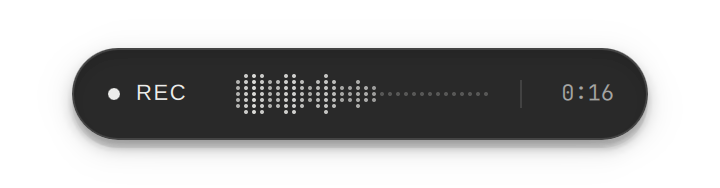

<p align="center">
  
</p>
<h2 align="center">OmaType</h2>
<p align="center">Fast, local voice typing for Omarchy.</p>

<p align="center">
  
</p>

<p align="center">
  
  
  
  
</p>

## Install

```bash
git clone --branch hybrid-hotkey https://github.com/Aayush9029/OmaType.git
cd OmaType
./install-omarchy.sh
```

Tap **Home** to start/stop. Hold for live dictation. **Delete** to cancel.

Built on [Voxtype](https://github.com/peteonrails/voxtype). Design and demo from [Petal](https://github.com/Aayush9029/petal).
