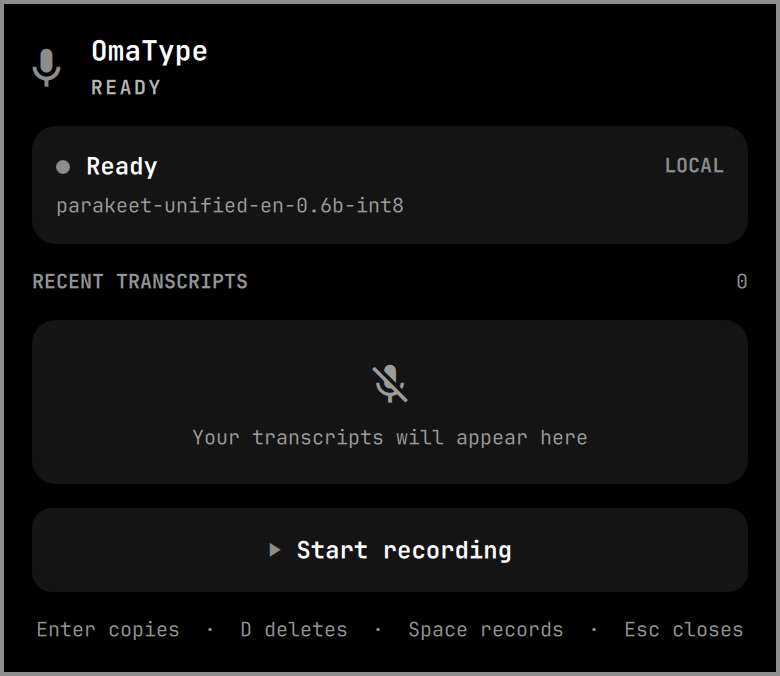

<p align="center">
  
  <h1 align="center">OmaType</h1>
  <p align="center">Fast local voice typing with tap-for-accuracy and hold-for-live dictation</p>
</p>

<p align="center">
  <a href="LICENSE"></a>
  <a href="https://omarchy.org"></a>
</p>

<p align="center">
  
  <br>
  
</p>

OmaType is an Omarchy-focused fork of [Voxtype](https://github.com/peteonrails/voxtype). It keeps one lightweight Parakeet model warm and gives the Home key two jobs:

- **Tap** once to record, then tap again to process the complete buffer and type the more accurate transcript.
- **Hold** for two seconds to begin typing live, then release to stop.

Audio capture begins on the first key-down, so changing from tap to hold never drops the opening words.

## Two ways to talk

| Home key | What happens |
| --- | --- |
| Tap once, then tap again | Records quietly, processes the complete buffer for better accuracy, then types it at your cursor. |
| Hold for 2 seconds | Starts real-time dictation at your cursor; release Home to stop. |

While OmaType is listening, a compact floating waveform stays above the bottom edge of the screen. It shows the live microphone level, recording mode, and elapsed time without requiring the bar menu to remain open.

## Install

On Omarchy:

```bash
git clone --branch hybrid-hotkey https://github.com/Aayush9029/OmaType.git
cd OmaType
./install-omarchy.sh
```

The installer builds an optimized binary, downloads and verifies the recommended ~633 MB INT8 Parakeet model, starts the user service, and adds OmaType's waveform and history panel to the Omarchy bar.

If Home is not already remapped by `keyd`, the installer prints the one-line mapping needed to keep the trigger from reaching focused applications.

## Usage

```text
Tap Home                        Start or finish an accurate batch recording
Hold Home for 2 seconds        Start live typing; release Home to finish
Delete                         Cancel the active recording
Left-click the bar icon        Open status and transcript history
Right-click the bar icon       Start or stop recording
```

Recording is not bound to Space while the menu is open; Home remains the global voice hotkey.

The panel follows Petal's compact menu-bar flow in Omarchy's native visual language: current status first, recent transcripts below it, then recording controls. Click a transcript to copy it; use its trash action twice to confirm deletion.

The Models screen offers three deliberate local choices instead of an overwhelming catalog:

- **Parakeet Live** — recommended for fast English tap and real-time dictation.
- **Whisper Small** — multilingual and accuracy-focused for tap mode.
- **SenseVoice Small** — the lightest multilingual option for Chinese, English, Japanese, Korean, and Cantonese.

Selecting a missing model downloads it locally, activates it, and restarts OmaType. Models remain loaded by the daemon for low-latency use.

```bash
omatype history list
omatype history list --json --limit 20
omatype history copy <id>
omatype history delete <id>
```

History contains transcript text and basic timing/model metadata only—never recorded audio—and stays at `~/.local/share/voxtype/history.json`. The newest 200 entries are retained.

The installed command and service are `omatype`; the internal data directory remains compatible with the upstream format.

## Credits

OmaType is built on Peter Jackson's MIT-licensed [Voxtype](https://github.com/peteonrails/voxtype), with the hybrid interaction, local history, and Omarchy shell experience maintained here.
